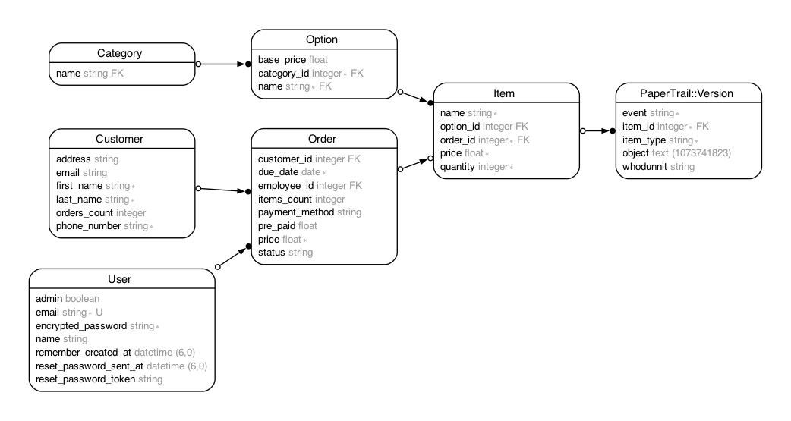
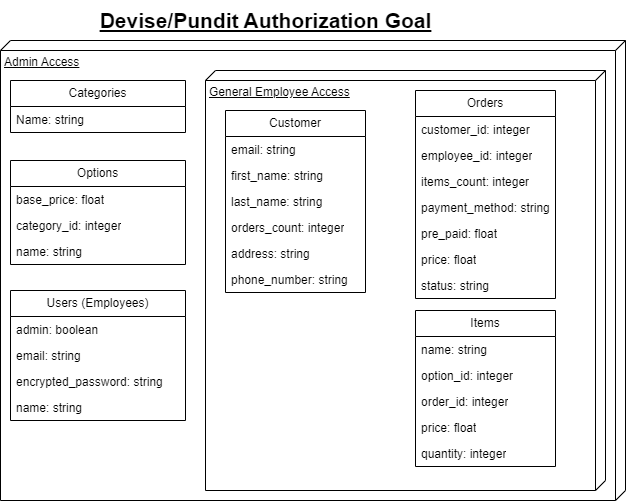

# Valenti Cleaners POS

## Description
This is a Ruby on Rails web app version of a Point of Service app intended to be used by employees to handle all customer order interactions and services that could be provided to the customers.

## Table of Contents
- [Installation](#installation)
- [Configuration](#configuration)
- [ERD](#erd)
- [Authorization](#authorization-in-progress)
- [Contributing](#contributing)

## Installation
1. Clone the repository:
`git clone https://github.com/AdolfoNava/POS-ROR-Project.git`

2. Navigate to the project directory:
`cd POS-ROR-Project`

3. Install the required gems:
`bundle install`

4. Set up the database:
`rails db:setup`

5. get sample data:
`rake sample_data` 

6. Start the Rails server:
`rails server`

## Configuration

Once you boot up the environment you can enter the test site using the sample_data user information and log in. No other setup is required hopefully the UI is clean enough to work for you.

## ERD

## Authorization (In-progress)

These will be eventually the layout of who can change what in the POS application

## Contributing

Contributions are welcome! Please follow these guidelines:

1. Fork the repository
2. Create a new branch (`git checkout -b feature-branch`)
3. Commit your changes (`git commit -m 'Add some feature'`)
4. Push to the branch (`git push origin feature-branch`)
5. Open a pull request
